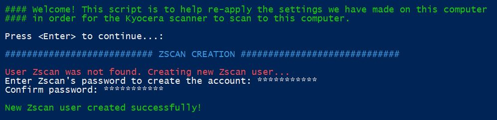
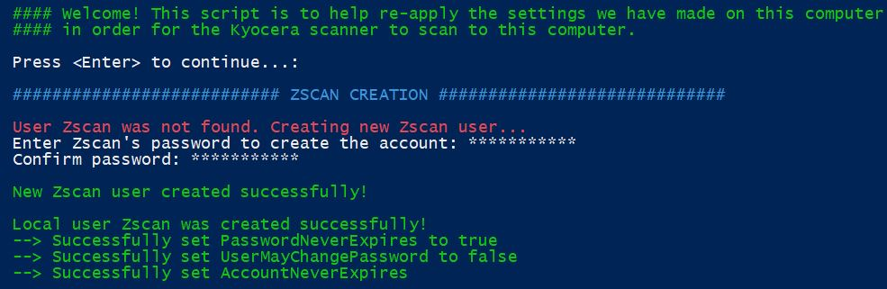
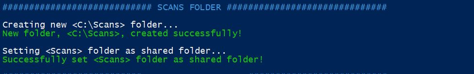
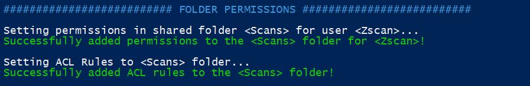
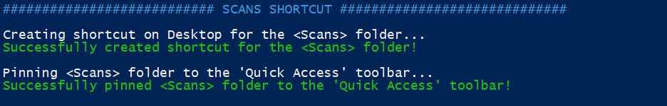
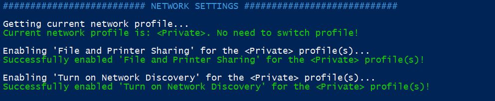
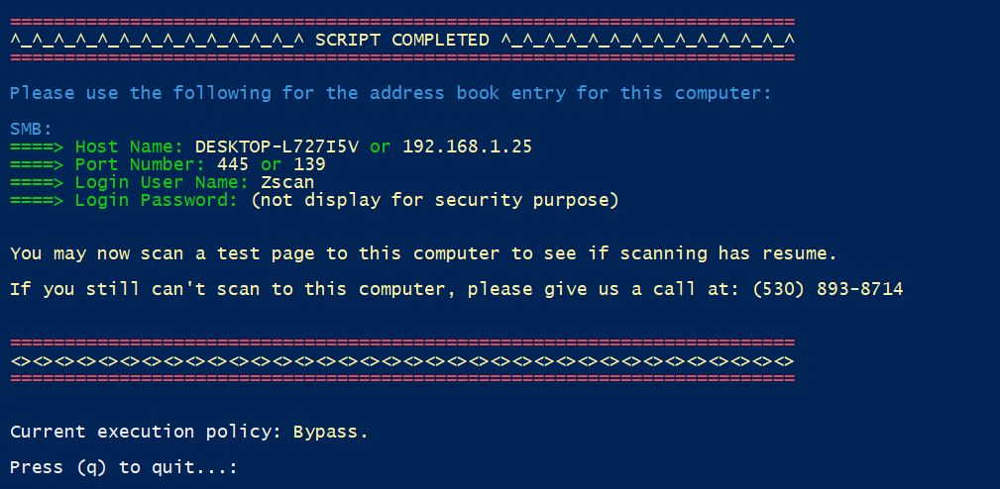

# Fix Kyocera Scanning
This is a simple PowerShell script that was created and used by me to help speed up the process in setting up a Kyocera printer's scanning option to a local Windows PC or Workstation. This script was developed solely on my free-time, outside of work, as I have no time during work hours to R&D this. This script may also be use to help setup SMB scanning options for other printers as well. The beauty of this script is that you can always use it to help troubleshoot or "RESET" the correct settings to allow for SMB scanning (ver. 2+) very quickly, after the initial setup. I mainly use this script for troubleshooting client computers or workstations that I know have the correct environment (e.g. uses SMB scanning, uses "Zscan", etc.). You can easily modified this script to be able to create a local user other than the static "Zscan" or you can use the other version that will prompt you for options [here](https://github.com/avue7/Kyocera-Scan-Setup).

<b>Please note:</b> this script assumes that SMB ver. 2+ is not disabled. For devices requiring SMB ver. 1, you must manually enable it as it comes disabled with Windows by default. This script requires elevated permission. The end-user must have admin priviledges or obtain it.
 
 
<b>**ADC techs, please note that the Kyocera printers with 0 series uses SMB ver. 1 for scanning purposes.</b>

## What Does It Do:
1. Creates a local user on client's computer called "Zscan" (please note: this value is static and can be changed under global variable <$NewUser> in the script). End-users must set a password in the initial setup. Password will be converted to a secure string.   
<b>**ADC Techs, please ensure you use the uniform scan password for the particular customer, unless the customer specifies otherwise. "Zscan" is our traditional user. If this account is not there, verify in the address book entry that they are not using another scanner account before proceeding. When in doubt, ask the customer.</b>

2. Once the local user "Zscan" is successfully created, the script will make sure "Zscan's" password never expires and cannot be changed. The account will also never expire. 

3. Checks to see if Scans folder exist in root C drive. If not found, creates one and sets folder as a shared folder. If found, outputs error for "Scans" folder creation and displays the number of items in the folder. 

4. Sets the permission for the Zscan user and adds the ACL rules for the Scans folder. If Scans folder already exists it will re-attempt to add the correct permissions for the Zscan user. 

5. Adds the shortcut of the Scans folder to the desktop and pins the Scans folder to the Quick Access toolbar.   
<b>**ADC Techs, if you set this portion manually, please ensure this option is added for our clients - most clients use this and finds it an important feature.</b>

6. Grabs the current network profile. If current network profile is "Domain", then enable "File and Printer Sharing" at firewall for domain and private network profiles. Also, turn on network discovery for domain and private network profiles. If current network profile is "Private", then do the same for only private network profiles. Else if current network profile is "Public", switch the current network profile to "Private" and enable the correct firewall settings. As a security measure, file and printer sharing, along with network discovery, should not be turned on for the public network profile.   
<b>**ADC Techs, please do not turn on "file and printer sharing" and "network discovery" for public network profiles.</b>

7. Once script tasks are completed, the script will then output within itself the results of the information that needs to be added to the Kyocera printer's (or any other printer that uses SMB scanning) address book entry.   
<b>**ADC Techs, please try using the hostname first as IP addresses may change more often; use IP if reserved.</b>

## How To Use:
1. Download both files: RUN_ME.bat file and SCAN_QUICK_FIX.ps1 into the same directory.
2. Double-click the RUN_ME.bat file. 
3. PowerShell script should run, follow thru. 

## Reasons For Creating This Script:
1. <b>Unity</b>: Ensures my colleagues and I set up scanning uniformly so that it will be easier to troubleshoot in the future.  
2. <b>Redundancy</b>: I do this on a normal basis at work, so it makes sense to automate possible-scripting tasks to a machine that can do it at a fraction of time.    
3. <b>Productivity</b>: The script is small in file size but can do the majority of the heavy lifting on the client's computer. It can be transferred to the client's computer within seconds. This script is especially helpful when I am on a remote session with a client.  While on the remote session, depending on latency and how fast the client's computer is, I can normally setup the client's computer for scanning from the Kyocera printer within 5-15 minutes manually without the script. With the script, I can do it within seconds. One of my biggest motivation in creating this script is for clients that have a slower computer and internet connection; It takes me even longer to setup the client's computer manually due to lag and latency problems. With the script, I can now cut this setup time drastically.  
4. <b>Efficiency</b>: This script eliminates human error during setup and troubleshooting. Ever set up something before and it doesn't work? Then you go back and realize you have forgotten to check one box or missed one simple setting? Well, the script will ensure human error does not happen. It is also effective for the new techs or techs who are unfamiliar with printer scanning setups as it help solves and points the tech to where the trouble can occur or where it is occuring.  
5. <b>Ease of Use</b>: This was another big motivation for me. Most of my clients can not perform their duties without their Kyocera printer. If there is an issue with scanning, it would cause a delay for them. Some of them have asked me if there was an easier way for them to troubleshoot their own problems without having to contact us and wait for us to fix it for them. Some have also asked if I would go through the settings with them so that they may possibly learn it. If we do what the script will do, there will be alot of steps to remember. Therefore, teaching them would not be effective as they will most likely forget where to go since they do not do this on a daily basis like I do. Thus, the script was created with the intention that all the client has to do was double-click and run the bat file, and the script will automatically set the correct settings for him/her. As a result, it has helped and continues to help the many clients that we have to decrease and mitigate their Kyocera's down time.
6. <b>Ease of Modification</b>: Not every customer's network or computer environment are alike. I wanted something that I can easily customize or modified later on. I needed something that I can also modify on the fly at a customer's site without the need for additional software. PowerShell comes default with Windows. Thus, this was the most effective way to do what I wanted. I can pretty much use any Windows computer to modifiy the file. While creating the script, I have ensured that global variables are apparent and concise documentations were used throughout the script. PowerShell was a good option to use because of its massive information on the internet. Most likely some pre-defined methods will be deprecated in the future and it will be updated here as well. :)
